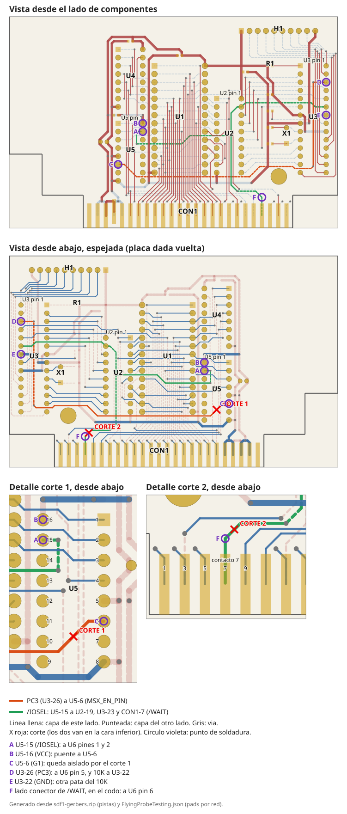

# Correcciones de la rev1 (v1.1)

La rev1 se fabricó antes de la revisión de esquemático. Estas correcciones se
aplican a mano sobre la placa. Este documento las lista en el orden en que
conviene hacerlas.

Los pines salen del netlist (`sdf1.net`) y la ubicación de las pistas, de los
Gerbers (`sdf1-gerbers.zip`), no del dibujo.

| Nombre | Qué es |
|---|---|
| `U5` | El segundo `74LS138`, el que decodifica los puertos 0x00/0x01 |
| `/IOSEL` | La salida `Y0` de U5 (pin 15): baja cuando el MSX accede a esos puertos. En el netlist se llama `MSX_CS_PIN` |
| `U6` | El `74LS03` que se agrega en el paso 4. Es el primer designador libre |

## Mapa de cortes y soldaduras

Sale de los Gerbers. Arriba, la placa vista del lado de componentes; abajo,
vista desde abajo y espejada, que es como la vas a tener en la mano para
cortar. En naranja la pista de `PC3` a U5 pin 6; en verde, `/IOSEL`. Las X
rojas son los cortes y los círculos violeta, los puntos de soldadura que se
nombran con letras en los pasos 2 a 4.

---

## 1 · RESET del ATmega al conector ICSP

**Qué:** cable del **pin 1 del ATmega** (`RESET`) a un pad libre o a un pin de
header accesible.

Con eso `H1` completa el ICSP: `1=VCC`, `2=SCK`, `3=MISO`, `4=MOSI`, `10=GND`,
más este `RESET`. Con el micro montado se graba con `make flash`, desde la raíz
del repo.

**Cómo saber que quedó bien:** si el programador lee la firma del micro, el
cable está bien. Sin `RESET` el micro no entra en modo programación.

> **Desconectá el módulo de SD antes de programar.** Muchos módulos no liberan
> bien `MISO` con su `CS` inactivo y el programador lee basura. Si el ICSP sale
> intermitente, es lo primero a descartar.

---

## 2 · Separar U5 del enable del firmware

**Qué:** hoy `PC3` (ATmega pin 26, `MSX_EN_PIN`) llega al **pin 6 de U5**
(`G1`, el enable del decodificador). Se corta esa pista y el pin 6 queda fijo a
VCC.

| | Dónde |
|---|---|
| **Corte 1** | Cara inferior. La pista sale del **pin 6 de U5** hacia adentro del integrado, recta unos 2 mm, y dobla en diagonal entre las dos filas de patas, hacia el lado del pin 8. Cortá **la diagonal por la mitad**: mide 5,4 mm y tiene casi 3 mm hasta el cobre vecino. Así el corte queda lejos del pad donde va el puente |
| **Puente** | Del **pin 6 de U5** (punto C) al **pin 16 de U5** (punto B, VCC), que está en la otra fila, a la altura del pin 1 |

**Qué queda:** `/IOSEL` pasa a ser decodificación pura de bus: el '138 queda
siempre habilitado y su salida depende sólo de la dirección. Sigue yendo a
`U2` pin 19 (`/OE` del '245) y a `U3` pin 23 (`PC0`), que **no se tocan**. `PC3`
queda libre para el paso 4; su pista queda colgando del pin 26 del ATmega, sin
llegar a ningún lado, y no molesta.

**Por qué:** hoy `EN` está adentro de la decodificación, así que cuando el
firmware lo baja para soltar `/WAIT` apaga también el búfer de datos, en un
momento en que el Z80 todavía no muestreó el bus. Además fabrica él mismo el
flanco que dispara su propia interrupción, y deja una ventana en la que el
decodificador está apagado y un acceso del MSX se pierde en silencio.

---

## 3 · Pull-down en `PC3`

**Qué:** resistencia de 10 K entre el **pin 26 del ATmega** (`PC3`, punto D) y
GND. El **pin 22** del ATmega (punto E) es GND y está en la misma fila, cuatro
pines más allá: 10,16 mm, justo el paso de una resistencia THT común. Va del
lado de abajo, entre esas dos patas.

**Por qué:** desde el reset hasta que corre `setup()` pasan decenas de
milisegundos en los que los pines del ATmega son entradas en alta impedancia.
Después del paso 4, `PC3` maneja la compuerta de `/WAIT` de U6, y una entrada
TTL sin conectar flota **alto**: el primer acceso del MSX a los puertos
0x00/0x01 clava `/WAIT` antes de que el firmware exista y cuelga la máquina.

Con el pull-down, el cartucho no pide espera hasta que el firmware decide lo
contrario.

---

## 4 · U6 — `74LS03` para `/WAIT`

Un DIP-14 al aire (*dead bug*) o en piggyback. El `74LS03` es NAND cuádruple
con **salida de colector abierto**: la salida sólo puede tirar a bajo, que es
lo que pide `/WAIT`. Se usan **dos** de sus cuatro compuertas.

**Corte 2:** cara inferior. La pista de `/WAIT` que llega al **contacto 7 del
borde** (`CON1-7`). En esa cara están los impares; mirando la placa desde abajo,
con el borde de contactos hacia vos, el 1 es el del extremo izquierdo y el 7 es
el cuarto. La pista sale de un via, va horizontal, dobla en diagonal y baja
recta al contacto. Cortá **la diagonal**, a 1,5 mm
antes del codo donde se vuelve vertical. Así el codo (punto F) queda del lado
del conector, con más de 2 mm libres alrededor, para soldar ahí el cable que
viene de U6.

> **No sueldes sobre el contacto dorado.** Es lo que entra en el slot del MSX.
> Raspá la máscara en el codo y soldá ahí.

**Alimentación:** pin 14 a VCC, pin 7 a GND, 100 nF entre ambos, lo más corto
posible.

**Las dos compuertas:**

| Compuerta | Entradas | Salida | Función |
|---|---|---|---|
| 1 | pines 1 y 2, juntos → `U5` pin 15 (punto A) | pin 3, con pull-up de 4K7 a VCC | inversor: `/IOSEL` → `IOSEL_H` |
| 2 | pin 4 → pin 3 · pin 5 → `PC3`, ATmega pin 26 (punto D) | pin 6 → `CON1-7`, lado conector del corte 2 (punto F) | `/WAIT` |

`/WAIT` baja cuando el MSX accede a los puertos del cartucho (`IOSEL_H` en
alto) **y** el firmware tiene `PC3` en alto. El firmware lo suelta bajando
`PC3`.

**Pull-up del pin 3:** 4K7 de VCC (el propio pin 14 de U6 sirve) al pin 3.
Hace falta porque la salida es de colector abierto: sin la resistencia, el pin
3 nunca sube y la compuerta 2 nunca se entera del acceso. El pin 6 **no** lleva
pull-up: la placa madre del MSX ya lo tiene en `/WAIT`.

**Compuertas 3 y 4, sin usar:** pines 9, 10, 12 y 13 a GND; las salidas 8 y 11
quedan al aire. Quedan disponibles para `/BUSDIR`, que por ahora no se hace.

**Por qué `/WAIT` en colector abierto:** es una línea compartida con pull-up en
la máquina, pensada para atacarse en colector abierto. La salida totem-pole del
'138 la fuerza activamente a alto cuando está inactiva, y pelea contra la
máquina o contra otro cartucho que quiera pedir espera.

> **No uses un diodo Schottky en lugar del '03.** El `V_OL` del '138 llega a
> 0,5 V y un Schottky cae 0,3–0,4 V: el nivel bajo en `/WAIT` queda en
> 0,8–0,9 V contra un `V_IL` máximo de 0,8 V. Queda justo del lado malo del
> umbral.

---

## 5 · Cambios en el zócalo (sin soldadura)

| Ref | Sacar | Poner |
|---|---|---|
| U2 | `SN74LS245N` | `SN74HCT245N` |
| U4, U5 | `SN74LS138N` | `SN74HCT138N` |

**Por qué:** el `V_OH` mínimo garantizado de un '138 LS es 2,7 V, y el `V_IH`
del ATmega328P a 5 V es 3,0 V. `U5.Y0` maneja `PC0`, así que está fuera de
especificación. En la práctica una salida LS descargada se para en 3,4 V y
anda, pero es margen prestado. Los HCT tienen entradas compatibles con TTL y
salidas a nivel CMOS, mismo pinout y mismo precio, y de paso cargan el bus del
MSX con microamperes en vez de 0,4 mA por entrada.

---

## A probar · `/RESET` del MSX a `PB0`

**Estado:** sin probar. Si funciona, pasa a la rev2.

**Qué:** cable de `CON1-15` (`/RESET` del MSX) a `H1-7` (`PB0`, ATmega pin 14).

**Por qué así y no al RESET del ATmega:** si reseteás el ATmega, se desmonta la
SD y hay que volver a inicializar SdFat, que en una tarjeta lenta puede tardar
cientos de milisegundos — justo cuando la máquina ya está buscando la DiskROM.
Llevándolo a un GPIO, el firmware resetea sólo su máquina de protocolo
(`_cmd_st`, transferencia parcial, soltar `/WAIT`) y conserva el montaje y la
imagen DSK seleccionada.

**Requiere firmware:** hoy el firmware no mira `PB0`, así que este cable solo
no hace nada.

---

## Verificación, con el cartucho fuera del MSX

Antes de enchufarlo, con el téster en continuidad:

- [ ] `U5` pin 6 **ya no** tiene continuidad con el ATmega pin 26 (corte 1)
- [ ] `U5` pin 6 tiene continuidad con VCC
- [ ] `CON1-7` **ya no** tiene continuidad con `U5` pin 15 (corte 2)
- [ ] `U5` pin 15 **sí** tiene continuidad con `U2` pin 19 y con el ATmega pin 23
- [ ] 10 K entre el ATmega pin 26 y GND
- [ ] `U6` pin 14 a VCC, pin 7 a GND; pines 9, 10, 12 y 13 a GND
- [ ] `U6` pines 1 y 2 con continuidad a `U5` pin 15
- [ ] `U6` pin 4 con continuidad al pin 3, y 4K7 entre el pin 3 y VCC
- [ ] `U6` pin 5 con continuidad al ATmega pin 26
- [ ] `U6` pin 6 con continuidad a `CON1-7`
- [ ] No hay continuidad entre VCC y GND

---

## Después de las correcciones: firmware

Las correcciones de hardware no se lucen solas. Del lado del software:

1. **Reactivar el checksum** en `DSKIO` y devolver carry con `A=4` si falla.
   Hoy las dos ramas terminan en `SCF`/`CCF` — carry limpio siempre — y la
   comparación está comentada. Sin eso no tenés cómo saber si la corrección
   quedó bien: un error de hardware llega a MSX-DOS como datos corruptos, no
   como error de disco.
2. **Handshake en `INIHRD`:** que el firmware escriba un valor mágico en
   `_stat` al terminar de inicializar, y que `INIHRD` gire leyendo el puerto
   0x01 hasta verlo, con timeout. No uses "distinto de `FFh`": el bus flotando
   *suele* dar `FFh` pero no está garantizado.
3. **Recién después**, sacar los `EX (SP),HL` de las primitivas de
   transferencia. Son estados de espera por byte que existen para tapar el
   problema del paso 2 de este documento. Sacalos **una vez que hayas
   verificado** que la corrección funciona, no antes, y con el checksum activo
   para que te avise si te pasaste.
